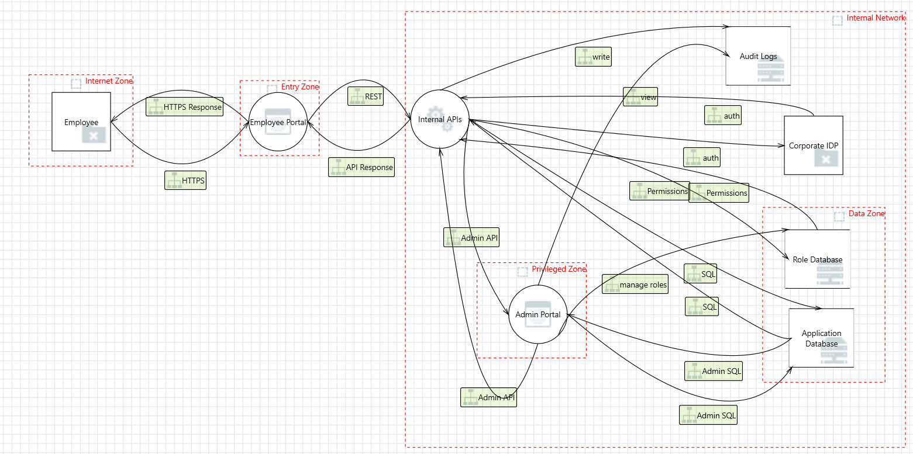
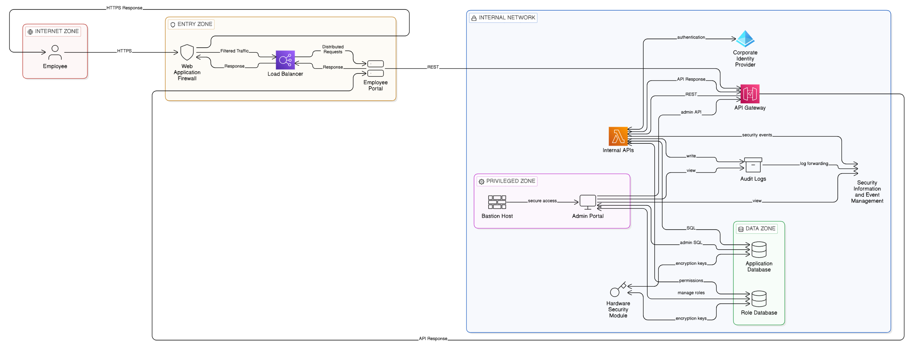

# Assignment 1 - Security Architecture and Design
## Internal Enterprise Application

# Task 1: System Definition and Architecture
## Internal Enterprise Application

### Application Components

| Component | Type | Description |
|-----------|------|-------------|
| Employee Portal | Frontend | Web interface employees use to access the system. Handles user sessions and serves UI. |
| Internal APIs | Backend Services | REST APIs that process all business logic, enforce rules, and coordinate data flow. |
| Application Database | Data Storage | Stores employee records, business data, and transactions. |
| Role Database | Data Storage | Stores permissions, roles, and access control matrices. |
| Corporate IDP | External Integration | Central identity provider (Active Directory/Okta) that handles authentication. |
| Audit Logs | Data Storage | Immutable storage for all user actions and system events. |
| Admin Portal | Admin Access | Privileged interface for administrators to manage users, roles, and system config. |

### Users and Roles

| User Type | Role | Access Level | Description |
|-----------|------|--------------|-------------|
| Employee | Regular staff | Basic | Can access portal, view own data, submit requests |
| Manager | Team supervisor | Elevated | Can view team data, approve requests |
| Administrator | IT/System admin | Full | Can manage users, roles, and system configuration |
| Auditor | Compliance | Read-only | Can view logs and access reports |
| Service Account | Automated processes | API-only | Used by batch jobs and system integrations |

### Data Types Handled

| Data Type | Examples | Classification |
|-----------|----------|----------------|
| Personally Identifiable Information (PII) | Name, Email, Employee ID, Address | Sensitive |
| Authentication Data | Password hashes, MFA tokens | Critical |
| Role Data | Permissions, group memberships | Internal |
| Business Records | Reports, documents, transactions | Internal |
| Audit Logs | User actions, timestamps, IPs | Sensitive |
| Financial Data | Salary, bonuses | Highly Sensitive |

### External Dependencies

| Dependency | Purpose | Criticality |
|------------|---------|-------------|
| Corporate Identity Provider | Employee authentication | HIGH |
| Email System | Notifications and alerts | MEDIUM |
| DNS Services | Name resolution | MEDIUM |
| Backup Infrastructure | Data protection | HIGH |

### Trust Boundaries

| Boundary | Name | Contains | Trust Level |
|----------|------|----------|-------------|
| B1 | Internet Zone | Employee only | Untrusted |
| B2 | DMZ/Entry Zone | Employee Portal | Semi-trusted |
| B3 | Internal Network | APIs, IDP, Admin Portal, Databases, Logs | Trusted |
| B4 | Privileged Zone | Admin Portal | Highly Restricted |
| B5 | Data Zone | Application DB, Role Database | Most Restricted |

### Architecture Diagram

*Diagram shows all components, data flows (HTTPS, REST, SQL), and trust boundaries with clear zone separation.*

## Task 2: Asset Identification and Security Objectives

### Asset Inventory Table

| Asset ID | Asset Name | Description | Location | Classification |
|----------|------------|-------------|----------|----------------|
| A001 | Employee Credentials | Usernames, password hashes, MFA tokens | Corporate IDP | Critical |
| A002 | Session Tokens | Active user session identifiers | Employee Portal, APIs | Critical |
| A003 | Employee PII | Names, emails, employee IDs, addresses | Application Database | Sensitive |
| A004 | Role Permissions | RBAC matrices, access rights, group memberships | Role Database | Internal |
| A005 | Business Data | Internal documents, reports, transactions | Application Database | Internal |
| A006 | Audit Logs | User actions, timestamps, IP addresses | Audit Logs | Sensitive |
| A007 | API Keys | Service-to-service authentication tokens | Internal APIs, Config files | Critical |
| A008 | Financial Data | Salary information, bonuses, expenses | Application Database | Highly Sensitive |
| A009 | Admin Credentials | Privileged account credentials | Corporate IDP | Critical |
| A010 | Business Logic | Application code, API endpoints, workflows | Internal APIs | Internal |
| A011 | Database Backups | All data backups | Backup Storage | Critical |
| A012 | Encryption Keys | Keys used for data encryption | HSM/Key Store | Critical |

### Mapping Assets to Security Objectives

| Asset ID | Asset Name | Confidentiality | Integrity | Availability | Accountability |
|----------|------------|-----------------|-----------|--------------|----------------|
| A001 | Employee Credentials | HIGH | HIGH | MEDIUM | HIGH |
| A002 | Session Tokens | HIGH | HIGH | MEDIUM | MEDIUM |
| A003 | Employee PII | HIGH | MEDIUM | MEDIUM | HIGH |
| A004 | Role Permissions | HIGH | HIGH | HIGH | HIGH |
| A005 | Business Data | MEDIUM | HIGH | MEDIUM | MEDIUM |
| A006 | Audit Logs | HIGH | HIGH | MEDIUM | HIGH |
| A007 | API Keys | HIGH | HIGH | MEDIUM | HIGH |
| A008 | Financial Data | HIGH | HIGH | MEDIUM | HIGH |
| A009 | Admin Credentials | HIGH | HIGH | HIGH | HIGH |
| A010 | Business Logic | MEDIUM | HIGH | LOW | LOW |
| A011 | Database Backups | HIGH | HIGH | MEDIUM | MEDIUM |
| A012 | Encryption Keys | HIGH | HIGH | HIGH | HIGH |

### Security Objectives Definition

| Objective | Definition | Measurement |
|-----------|------------|-------------|
| Confidentiality | Data is accessible only to authorized users | Encryption, access controls |
| Integrity | Data is accurate and hasn't been tampered with | Checksums, validation, signing |
| Availability | Data is accessible when needed | Uptime, redundancy, backups |
| Accountability | Actions can be traced to specific users | Audit logs, non-repudiation |

### Critical Asset Risk Summary

| Risk Level | Asset Count | Examples |
|------------|-------------|----------|
| HIGH | 9 | Credentials, PII, Financial Data, Keys |
| MEDIUM | 2 | Business Data, Backups |
| LOW | 1 | Business Logic |

## Task 3: Threat Modeling

### Threat Model Table

| ID | Threat Description | Affected Component | STRIDE Category | Required Area | Impact | Risk Level |
|----|-------------------|-------------------|-----------------|---------------|--------|------------|
| T01 | Spoofing the Employee External Entity | Employee → Employee Portal | Spoofing | Authentication | Attacker impersonates legitimate employee to gain unauthorized access | HIGH |
| T02 | Spoofing the Corporate IDP | Internal APIs → Corporate IDP | Spoofing | Authentication | Attacker impersonates identity provider to capture credentials | HIGH |
| T03 | Elevation Using Impersonation | Internal APIs → Employee Portal | Elevation of Privilege | Authorization | API impersonates portal context to gain additional privileges | HIGH |
| T04 | Weak Access Control for Application Database | Application Database | Information Disclosure | Data storage | Unauthorized reading of sensitive employee PII and financial data | HIGH |
| T05 | Weak Access Control for Role Database | Role Database | Information Disclosure | Data storage | Unauthorized modification of permissions leading to privilege escalation | HIGH |
| T06 | SQL Injection via Internal APIs | Internal APIs → Application Database | Tampering | API communication | Attacker executes malicious SQL queries to extract or modify data | HIGH |
| T07 | Cross Site Scripting on Employee Portal | Employee Portal | Tampering | API communication | Attacker injects malicious scripts to steal session tokens | HIGH |
| T08 | Data Flow Sniffing on REST API | Employee Portal → Internal APIs | Information Disclosure | API communication | Attacker intercepts API traffic to capture sensitive data | HIGH |
| T09 | Potential Data Repudiation by Admin Portal | Admin Portal | Repudiation | Logging and monitoring | Admin denies making unauthorized changes with no audit evidence | MEDIUM |
| T10 | Audit Logs Spoofing | Internal APIs → Audit Logs | Spoofing | Logging and monitoring | Attacker redirects logs to fake storage to hide malicious activity | HIGH |
| T11 | Data Store Denies Writing Data | Audit Logs | Repudiation | Logging and monitoring | Logs claim they didn't receive events, breaking audit trail | MEDIUM |
| T12 | Cross Site Scripting on Admin Portal | Admin Portal | Tampering | Administrative access | Attacker injects scripts to steal admin session or execute actions | HIGH |
| T13 | Elevation Using Impersonation | Admin Portal → Internal APIs | Elevation of Privilege | Administrative access | Admin portal impersonates APIs to gain higher privileges | HIGH |
| T14 | Spoofing Destination Data Store | Admin Portal → Role Database | Spoofing | Administrative access | Attacker redirects role updates to fake database | HIGH |
| T15 | Potential Excessive Resource Consumption | Internal APIs → Application Database | Denial of Service | Data storage | Resource exhaustion attack makes database unavailable | MEDIUM |

---

### Threats by Required Area

| Required Area | Threat IDs |
|---------------|------------|
| Authentication | T01, T02 |
| Authorization | T03 |
| Data storage | T04, T05, T15 |
| API communication | T06, T07, T08 |
| Logging and monitoring | T09, T10, T11 |
| Administrative access | T12, T13, T14 |

---

### Risk Reasoning

| ID | Risk Reasoning |
|----|----------------|
| T01 | **HIGH** - Internet-facing authentication point is primary attack vector; successful spoofing grants system access to attacker |
| T02 | **HIGH** - Identity Provider is trusted third party; spoofing compromises all authentication across the entire system |
| T03 | **HIGH** - Privilege escalation allows attacker to bypass access controls and reach sensitive data without authorization |
| T04 | **HIGH** - Application Database contains PII and financial data; breach causes compliance violations (GDPR/CCPA) and reputational damage |
| T05 | **HIGH** - Role Database controls all permissions; tampering leads to lateral movement and privilege escalation across system |
| T06 | **HIGH** - SQL injection is common, high-impact attack that can lead to full data breach of all employee records |
| T07 | **HIGH** - XSS on Employee Portal affects all employees; session theft leads to account takeover and data exposure |
| T08 | **HIGH** - Unencrypted API traffic exposes sensitive data in transit to interception via man-in-the-middle attacks |
| T09 | **MEDIUM** - Admin actions require accountability for compliance; lack of logs hinders incident investigation and forensics |
| T10 | **HIGH** - If logs are spoofed, attacks go completely undetected and cannot be investigated or traced |
| T11 | **MEDIUM** - Incomplete audit trail breaks non-repudiation requirement for compliance and legal proceedings |
| T12 | **HIGH** - Admin portal compromise gives attacker full system control including user management and data access |
| T13 | **HIGH** - Admin impersonating APIs can bypass business logic and security controls meant to prevent abuse |
| T14 | **HIGH** - Role updates redirected to attacker-controlled database grants unauthorized permissions to attacker accounts |
| T15 | **MEDIUM** - DoS affects availability but can be mitigated with rate limiting, auto-scaling, and resource monitoring |

---

### Threat Diagram

## Task 4: Secure Architecture Design

### Security Controls Justification

| Control Category | Control Implemented | Justification |
|------------------|---------------------|---------------|
| Identity and Access Management | API Gateway with rate limiting, Multi-Factor Authentication for admin access, Certificate-based authentication for Identity Provider communication | API Gateway acts as central enforcement point for authentication before requests reach internal APIs, preventing unauthorized access. MFA for admin portal mitigates credential theft risks (T01, T02). Certificate-based authentication prevents Identity Provider spoofing attacks (T02). |
| Network Segmentation | Web Application Firewall at perimeter, Bastion Host for privileged access, Five distinct security zones (Internet, Entry, Internal, Privileged, Data) | Web Application Firewall filters malicious traffic at entry point, blocking common attacks like cross-site scripting (T07, T12). Bastion host creates single controlled entry point for administrative access, reducing attack surface. Zones ensure compromise in one area (like Entry Zone) does not expose sensitive databases in Data Zone (T04, T05). |
| Data Protection | TLS 1.3 encryption for all connections, Encrypted databases, Hardware Security Module for key management | Encryption in transit prevents man-in-the-middle attacks and data sniffing (T08). Encryption at rest protects sensitive PII and financial data from unauthorized access if storage is compromised (T04). Hardware Security Module ensures encryption keys never leave secure hardware and provides centralized key management. |
| Secrets Management | Hardware Security Module for all encryption keys and API secrets | Secrets are never stored in configuration files or code repositories. Centralized key storage enables rotation, auditing, and strict access control. Prevents credential exposure and reduces risk of insider theft (T01, T02). |
| Monitoring and Logging | Security Information and Event Management integration, Centralized immutable audit logs | Security Information and Event Management aggregates logs from all components for real-time alerting and threat detection. Immutable audit logs prevent tampering and provide non-repudiation for compliance (T09, T11). Log forwarding ensures redundancy if primary logs are compromised (T10). |
| Secure Deployment Practices | Load balancer for availability, API Gateway rate limiting, Just-in-time privileged access | Load balancer distributes traffic and provides DDoS protection, ensuring availability (T15). Rate limiting prevents resource exhaustion and denial of service attacks (T15). Just-in-time access to admin portal via bastion host reduces persistent attack surface for privileged accounts (T12). |

---

### Defense-in-Depth Summary

| Layer | Controls |
|-------|----------|
| Perimeter Defense | Web Application Firewall, Load Balancer, TLS 1.3 encryption |
| Network Security | Zone segmentation (Internet, Entry, Internal, Privileged, Data), Bastion Host |
| Application Security | API Gateway, Rate limiting, Input validation |
| Data Security | Database encryption, Hardware Security Module, Encrypted connections |
| Identity Security | Multi-Factor Authentication, Certificate-based authentication, API Keys |
| Monitoring | Security Information and Event Management, Centralized immutable audit logs |

---

### Updated Architecture Diagram

