## DVWA Security Report

## Command Injection

### Security Level: Low

**Payload Used:** `127.0.0.1; ls`

**Result:** Success - Both the ping command and the directory listing command executed, displaying the contents of the current directory after the ping results.

**Screenshot:**


**Explanation of why it worked:**
The application passes user input directly to the system shell without any validation or sanitization. The semicolon (;) acts as a command separator, allowing multiple commands to be chained together. Since the input is not checked to ensure it contains only an IP address, the system executes both the intended ping command and the injected ls command.

**Explanation of why it failed at higher level:**
At Medium security, the application begins filtering certain characters like semicolons, but the filtering is incomplete and can be bypassed. At High security, proper input validation is implemented to only allow IP address formats.

### Security Level: Medium

**Payload Used:** `127.0.0.1 & ls`

**Result:** Success - The ampersand (&) operator allowed command injection, executing both the ping and ls commands.

**Screenshot:**


**Explanation of why it worked:**
At Medium security, the application filters out semicolons (;) but fails to block other command separators like the ampersand (&). The application uses a blacklist approach that is incomplete, blocking only certain characters while leaving others vulnerable. The ampersand tells the shell to run the first command and then execute the second command in the background, allowing the injection to succeed.

**Explanation of why it failed at higher level:**
At High security, the application implements proper input validation using a whitelist approach. It strictly validates that the input contains only characters that belong to an IP address (numbers and dots) and rejects any input with special characters, shell metacharacters, or non-IP address patterns. This prevents any command injection regardless of which operator is used.

### Security Level: High

**Payload Used:** `127.0.0.1; ls`

**Result:** Failed - Only the ping command executed. The directory listing (ls) did not appear in the output.

**Screenshot:**


**Explanation of why it failed at higher level:**
At High security, the application implements proper input validation using a whitelist approach. It strictly validates that the input contains only characters that belong to a valid IP address format (numbers and dots). Any input containing special characters, letters, or shell metacharacters like semicolons (;) is rejected or sanitized before being passed to the system. This prevents command injection by ensuring only the intended IP address is processed by the ping command.


## Cross Site Request Forgery (CSRF)

### Security Level: Low

**Payload Used:**
```html
<html>
  <body>
    <h1>Win a Free Gift Card!</h1>
    <p>Click the button below to claim your $100 Amazon gift card:</p>
    
    <form action="http://localhost:8080/vulnerabilities/csrf/" method="GET">
      <input type="hidden" name="password_new" value="attacker123" />
      <input type="hidden" name="password_conf" value="attacker123" />
      <input type="hidden" name="Change" value="Change" />
      <input type="submit" value="Claim Your Gift Card!" />
    </form>
  </body>
</html>
```

**Result:** Success - The password was changed from "newpassword123" to "attacker123" without requiring the current password or any additional verification. The attack worked by simply getting the authenticated user to click a button on a malicious page.

**Screenshot:**


**Explanation of why it worked:**
The application accepts password changes via GET requests with all parameters in the URL. It does not implement any anti-CSRF tokens, does not require the current password for verification, and relies solely on session cookies for authentication. When an authenticated user visits a malicious page, their browser automatically includes their session cookies with the forged request. The server sees a valid session and processes the password change request, unable to distinguish between a legitimate request from the actual user and a forged request from an attacker's site.

**Explanation of why it failed at higher level:**
At higher security levels, the application implements anti-CSRF tokens that must accompany state-changing requests. These tokens are unique per session and validated by the server, making it impossible for an attacker to forge a valid request without knowing the current token. Additionally, the application may require current password verification or switch to using POST requests for sensitive operations, further protecting against CSRF attacks.


### Security Level: Medium
**Payload Used:**
```html
<html>
  <body>
    <form action="http://localhost:8080/vulnerabilities/csrf/" method="GET">
      <input type="hidden" name="password_new" value="mediumtest123" />
      <input type="hidden" name="password_conf" value="mediumtest123" />
      <input type="hidden" name="Change" value="Change" />
      <input type="submit" value="Click me!" />
    </form>
  </body>
</html>
```

**Result:** Failed - The request was rejected with the message "That request didn't look correct."

**Screenshot:**


**Explanation of why it worked:**
At Low security, the application accepts password changes via GET requests without any validation of where the request originated. It does not implement anti-CSRF tokens or require the current password, allowing any malicious site to forge requests as long as the user is authenticated. The server blindly trusts the request because the user's session cookie is automatically included by the browser.

**Explanation of why it failed at higher level:**
At Medium security, the application validates the HTTP Referer header to ensure the request originated from the same domain. When the malicious HTML file is opened locally, it sends no Referer header or one that doesn't match localhost, causing the server to reject the request as suspicious.


### Security Level: High

**Payload Used:**
```html
<html>
  <body>
    <form action="http://localhost:8080/vulnerabilities/csrf/" method="GET">
      <input type="hidden" name="password_new" value="hightest123" />
      <input type="hidden" name="password_conf" value="hightest123" />
      <input type="hidden" name="Change" value="Change" />
      <input type="submit" value="Click me!" />
    </form>
  </body>
</html>
```

**Result:** Failed - The request was rejected with the message "CSRF token is incorrect."

**Screenshot:**


**Explanation of why it worked:**
At Low security, the application accepts password changes via GET requests without any validation of where the request originated. It does not implement anti-CSRF tokens or require the current password, allowing any malicious site to forge requests as long as the user is authenticated. The server blindly trusts the request because the user's session cookie is automatically included by the browser.

**Explanation of why it failed at higher level:**
At High security, the application implements anti-CSRF tokens that are unique to each user session. These tokens are generated by the server, embedded in forms, and must be submitted with any state-changing request. When a malicious site attempts to forge a request, it cannot know or include the correct token because it changes per session and cannot be predicted or obtained by an attacker from a different domain. The server validates the token before processing the password change, rejecting any request with a missing or incorrect token.


## File Inclusion

### Security Level: Low

**Payload Used:**`http://localhost:8080/vulnerabilities/fi/?page=../../../../../etc/passwd`

**Result:** Success - The contents of the /etc/passwd file were displayed, revealing system user accounts.

**Screenshot:**


**Explanation of why it worked:**
The application takes the 'page' parameter and directly includes it in a PHP include statement without any validation or sanitization. By using `../../../../../` directory traversal sequences, we can navigate up the directory structure to reach the root directory and then access sensitive system files like `/etc/passwd`. The server does not check if the requested file is within an allowed directory or if the path contains suspicious patterns.

**Explanation of why it failed at higher level:**
At higher security levels, the application implements input validation to block directory traversal sequences like `../` and restricts file inclusion to specific allowed files only. It may also use whitelisting to ensure only files from a predefined directory can be included.


### Security Level: Medium

**Payload Used:**`http://localhost:8080/vulnerabilities/fi/?page=..//..//..//..//etc/passwd`

**Result:** Success - The contents of the /etc/passwd file were displayed by bypassing the input filter using double slashes.

**Screenshot:**


**Explanation of why it worked:**
At Low security, no validation was performed, allowing direct directory traversal. The application blindly included any file path provided.

**Explanation of why it failed at higher level:**
At Medium security, the application implements basic filtering that removes or blocks `../` patterns. However, this filter is incomplete and can be bypassed using `..//` which still achieves directory traversal. The filter fails to recursively sanitize the input or account for variations in path traversal syntax. At High security, more robust validation would be implemented to block all such bypass attempts.


### Security Level: High

**Payload Used:**`http://localhost:8080/vulnerabilities/fi/?page=file:///etc/passwd`

**Result:** Success - The contents of the /etc/passwd file were displayed using the file:// wrapper, bypassing the High security restrictions.

**Screenshot:**
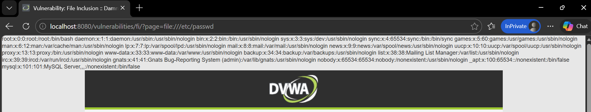

**Explanation of why it worked:**
At Low security, no validation was performed, allowing direct directory traversal. At Medium security, basic filtering was implemented but could be bypassed using techniques like `..//`.

**Explanation of why it failed at higher level:**
While High security blocks directory traversal sequences like `../` and `..//`, it fails to block PHP wrappers like `file://`. The application does not properly validate or restrict the use of stream wrappers, allowing an attacker to read system files using the file wrapper despite other protections being in place. This demonstrates that security controls must be comprehensive and consider all possible input vectors.


## File Upload

### Security Level: Low

**Payload Used:**
```php
<?php
system($_GET['cmd']);
?>
```
Saved as shell.php

**Result:** Success - The file was uploaded and can be accessed to execute system commands.

**Screenshot:**
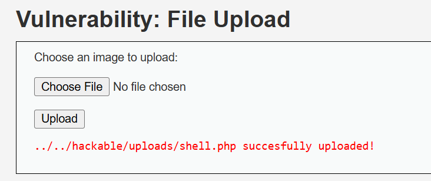

**Explanation of why it worked:**
At Low security, the application performs no validation on uploaded files. It does not check the file type, file content, or file extension. Any file, including malicious PHP scripts, can be uploaded and then accessed directly via the web server. Since PHP files are executed by the server, this allows an attacker to run arbitrary system commands by simply sending parameters to the uploaded shell.

**Explanation of why it failed at higher level:**
At higher security levels, the application implements file validation checks including file type verification, extension whitelisting, and content inspection. It may also rename uploaded files, store them outside the web root, or validate MIME types to prevent malicious file execution.


### Security Level: Medium

**Payload Used:**
```php
<?php
system($_GET['cmd']);
?>
```
Saved as shell.php.jpg

**Result:** Success - The file was uploaded successfully by using a double extension to bypass file type validation.

**Screenshot:**
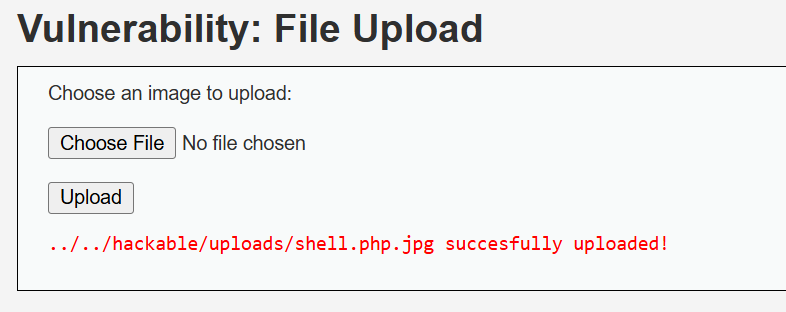

**Explanation of why it worked:**
At Medium security, the application implements basic file validation such as checking file extensions. However, it only checks the first extension or uses a weak blacklist approach. By using a double extension like .php.jpg, the application may only check the last extension (.jpg) and incorrectly assume the file is a safe image, while the server still executes it as a PHP file due to the .php extension being recognized first. This bypass demonstrates that extension-based validation alone is insufficient without proper file content inspection and server configuration to prevent script execution in upload directories.

**Explanation of why it failed at higher level:**
At High security, the application implements content validation that examines the actual file contents, not just the filename. Since a simple PHP file without a valid image header would fail content inspection, the upload would be rejected.


### Security Level: High

**Payload Used:**
```php
GIF89a
<?php
system($_GET['cmd']);
?>
```
Saved as shell.php.jpg

**Result:** Success - The file was uploaded successfully by combining an image header with a double extension to bypass file validation.

**Screenshot:**
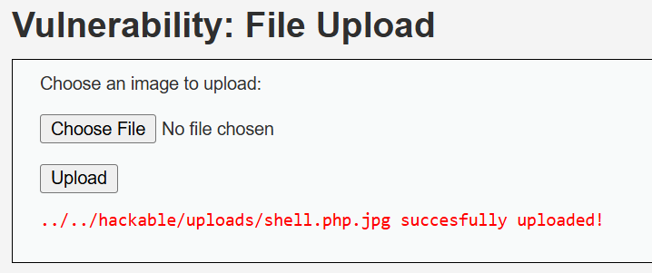

**Explanation of why it worked:**
At High security, the application checks file content, not just extensions. However, adding a valid GIF header at the beginning tricks the content validation into identifying the file as a legitimate image. The file passes inspection while the PHP code remains executable when accessed.

**Explanation of why it failed at higher level:**
Even higher security would combine multiple defenses: strict whitelist validation, complete content analysis, storing files outside web root, disabling script execution in upload directories, and scanning files in a sandbox before acceptance. This defense-in-depth approach would block both extension and content bypass techniques.


## SQL Injection

### Security Level: Low

**Payload Used:** `1' OR '1'='1`

**Result:** Success - All user records were displayed instead of just one, demonstrating a basic authentication bypass.

**Screenshot:**
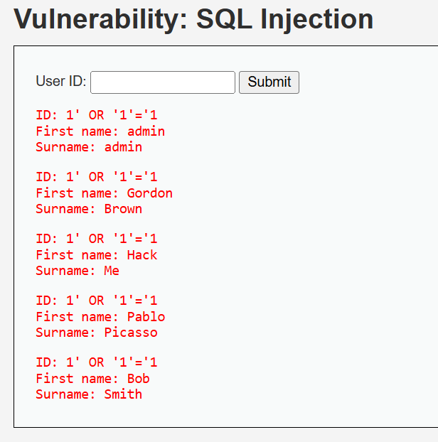

**Explanation of why it worked:**
The application takes user input and directly inserts it into an SQL query without any sanitization. The original query likely looks like:
```sql
SELECT first_name, last_name FROM users WHERE user_id = '$id'
```
When 1' OR '1'='1 is injected, the query becomes:
```sql
SELECT first_name, last_name FROM users WHERE user_id = '1' OR '1'='1'
```

Since '1'='1' is always true, the query returns all rows from the users table, bypassing the intended restriction to return only one specific user.

**Explanation of why it failed at higher level:**
At higher security levels, the application uses parameterized queries (prepared statements) which separate SQL logic from data. User input is treated as data only, not executable code, making injection impossible regardless of the payload. Additionally, input validation and escaping functions may be implemented to further protect against malicious input.


### Security Level: Medium

**Payload Used:** `1' OR '1'='1`

**Result:** The application replaced the user input field with a dropdown menu, preventing manual injection. Only predefined user IDs (1-5) can be selected, and each returns only its corresponding user record.

**Screenshot:**
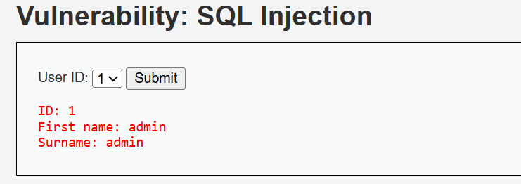

**Explanation of why it worked:**
At Medium security, the application implemented a dropdown menu that restricts user input to predefined values. This eliminates the attack surface by preventing arbitrary input from being submitted. In this implementation it effectively blocks the attack by removing the ability to inject malicious SQL syntax. 

**Explanation of why it failed at higher level:**
Since the application restricts input to predefined values through the dropdown menu, it prevents malicious SQL payloads from being submitted. As a result, the attacker cannot alter the structure of the SQL query, and the injection attempt fails.


### Security Level: High

**Payload Used:** `1' OR '1'='1`

**Result:** Failed - The payload was accepted as input but only returned the admin user record, not all users.

**Screenshot:**
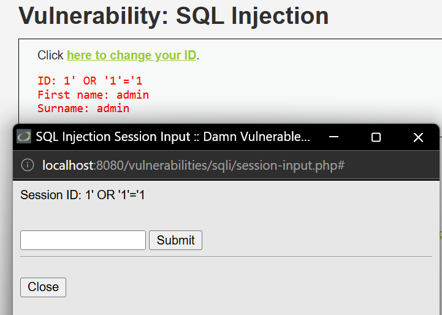

**Explanation of why it worked:**
At High security, the application uses parameterized queries that treat user input as data only, not as executable code. The SQL query structure is fixed, and the payload is processed as a literal string value to compare against the user_id field, preventing any injection.

**Explanation of why it failed at higher level:**
At the High security level, DVWA applies stronger protections to user input. The application processes the input more carefully before using it in the SQL query, which prevents the injected condition from changing the query logic. Which is why the attack does not return all users and only a normal result is shown.


## SQL Injection (Blind)

### Security Level: Low

**Payload Used:** `1' AND '1'='1`

**Result:** Success - The application returned "User ID exists in the database," confirming that the injection works and the condition evaluated to true.

**Screenshot:**
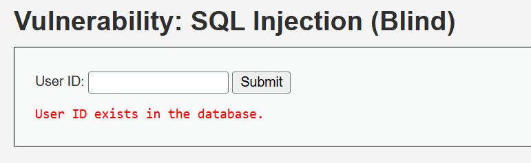

**Explanation of why it worked:**
The application takes user input and directly inserts it into an SQL query without any sanitization. The original query likely looks like:
```sql
SELECT user_id FROM users WHERE user_id = '$id'
```
When 1' AND '1'='1 is injected, the query becomes:
```sql
SELECT user_id FROM users WHERE user_id = '1' AND '1'='1'
```
Since '1'='1' is always true, the query executes successfully and returns a result if user ID 1 exists. The application then displays "User ID exists" based on whether any rows were returned, allowing an attacker to infer information through boolean conditions.

**Explanation of why it failed at higher level:**
At higher security levels, the application uses prepared statements and input validation to prevent SQL injection. User input is treated as data only, not executable code, so injected conditions like AND '1'='1' cannot alter the query logic. This blocks both regular and blind SQL injection attacks.


### Security Level: Medium

**Payload Used:**
`http://localhost:8080/vulnerabilities/sqli_blind/?id=1' AND '1'='1&Submit=Submit`

**Result:** Success - The application returned "User ID exists in the database," confirming that blind SQL injection works by bypassing the dropdown menu via direct URL requests.

**Screenshot:**
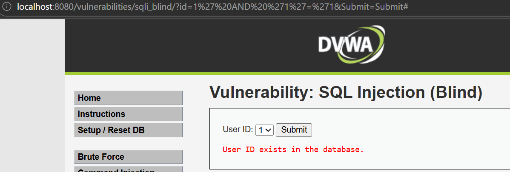

**Explanation of why it worked:**
At Medium security, the UI restriction (dropdown menu) is client-side only and does not protect against direct URL manipulation. The server-side code remains vulnerable.

**Explanation of why it failed at higher level:**
At High security, proper server-side input validation and prepared statements would be implemented to prevent injection regardless of how the request is sent.


### Security Level: High

**Payload Used:** `1 AND SLEEP(5)`

**Result:** Success - The application returned "User ID exists in the database" after a significant delay (approximately 5 seconds), confirming that time-based blind SQL injection works.

**Screenshot:**
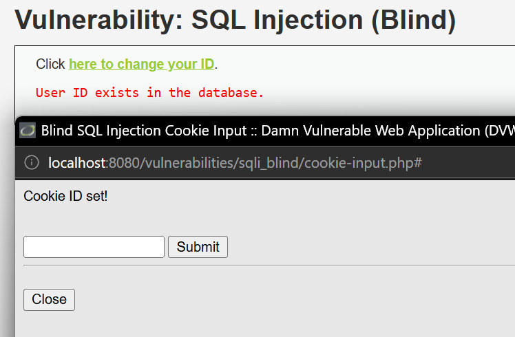

**Explanation of why it worked:**
At High security, the application may implement some protections but remains vulnerable to time-based blind SQL injection. The SLEEP(5) command is executed as part of the query, causing a delay before the response is returned. Since the application still displays a success message after the delay, it confirms that the injected SQL was executed.

**Explanation of why it failed at higher level:**
Secure implementations validate and sanitize user inputs before using them in database queries. Proper defenses such as parameterized queries, strict input validation, and prepared statements treat user input as data only, not executable code. This prevents malicious SQL commands like SLEEP() from being executed, eliminating time-based blind SQL injection attacks.


## Weak Session IDs

### Security Level: Low

**Payload Used:** Analyzed session ID generation pattern by clicking the "Generate" button multiple times.

**Result:** The session IDs are generated as simple sequential numbers (1, 2, 3, ...), making them highly predictable and vulnerable to session hijacking.

**Screenshot:**
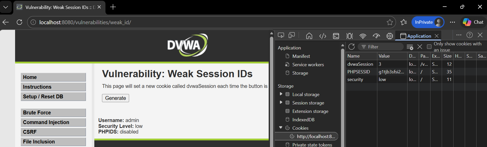

**Observations:**
- Click 1: `dvwaSession = 1`
- Click 2: `dvwaSession = 2`
- Click 3: `dvwaSession = 3`

**Explanation of why it worked:**
At Low security, the application generates session IDs using a simple incrementing counter with no randomness or complexity. An attacker can easily predict future session IDs and potentially hijack active user sessions by guessing valid IDs. This lack of entropy makes session fixation and session prediction attacks trivial.

**Explanation of why it failed at higher level:**
At higher security levels, session IDs are generated using strong cryptographic randomness rather than simple sequential numbers. This makes them unpredictable and resistant to session hijacking, brute-forcing, or session fixation attacks.


### Security Level: Medium

**Payload Used:** Not applicable - Analyzed session ID generation pattern by clicking the "Generate" button multiple times.

**Result:** The session IDs appear to be time-based values (likely Unix timestamps), which are still predictable if an attacker knows the approximate generation time.

**Screenshot:**
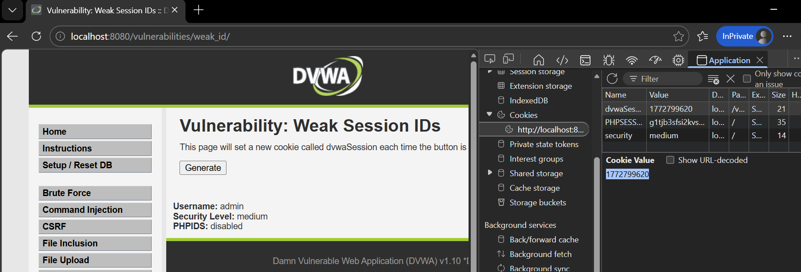

**Observations:**
- Click 1: `dvwaSession = 1772799576`
- Click 2: `dvwaSession = 1772799609`
- Click 3: `dvwaSession = 1772799620`

**Explanation of why it worked:**
At Low security, session IDs were simple sequential numbers. At Medium security, the application improved by using time-based values instead of simple increments.

**Explanation of why it failed at higher level:**
At Medium security, the session IDs are generated using time-based values which are still predictable within a certain timeframe. An attacker who knows roughly when a session was created could brute-force a small range of possible values. At High security, truly random cryptographic session IDs would be implemented to prevent any form of prediction or brute-forcing.


### Security Level: High

**Payload Used:** Analyzed session ID generation pattern by clicking the "Generate" button multiple times.

**Result:** The session ID remained constant (1772799620) across all clicks, indicating that the application now properly ties the session ID to the user's browser session and does not regenerate it unnecessarily.

**Screenshot:**
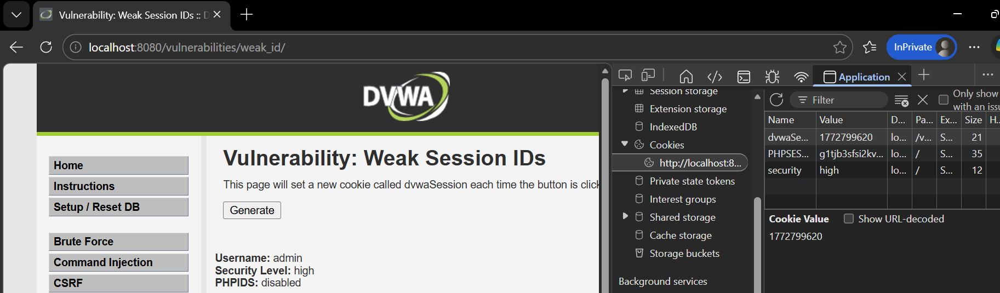

**Observations:**
- Click 1: `dvwaSession = 1772799620`
- Click 2: `dvwaSession = 1772799620`
- Click 3: `dvwaSession = 1772799620`

**Explanation of why it worked:**
At Low security, session IDs were simple sequential numbers. At Medium security, they improved to time-based values but remained predictable.

**Explanation of why it failed at higher level:**
At High security, the application properly manages session identifiers by maintaining a single, consistent session ID throughout the user's browser session. The "Generate" button no longer creates new session IDs, preventing session fixation attacks where an attacker could force a user to use a known session ID. Additionally, the initial session ID is likely generated using strong randomness when the session is first created.


## DOM Based Cross Site Scripting (XSS)

### Security Level: Low

**Payload Used:**`http://localhost:8080/vulnerabilities/xss_d/?default=<script>alert('XSS')</script>`

**Result:** Success - An alert box popped up displaying "XSS", confirming that JavaScript code was executed in the browser.

**Screenshot:**
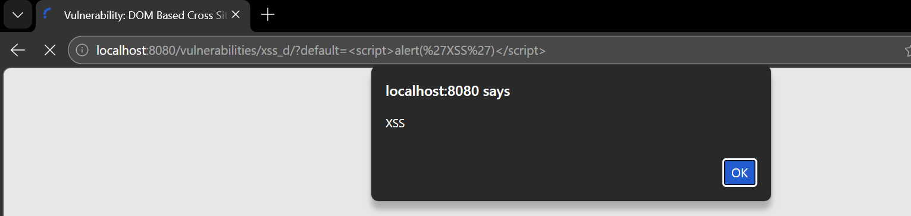

**Explanation of why it worked:**
The application takes the `default` parameter from the URL and injects it directly into the DOM using client-side JavaScript without any validation or sanitization. Since the content is inserted into the page and interpreted as HTML, the `<script>` tag is executed by the browser. This is a DOM-based XSS vulnerability because the attack payload modifies the DOM environment in the victim's browser, and the malicious script executes as a result of DOM manipulation rather than server-side reflection.

**Explanation of why it failed at higher level:**
At higher security levels, the application sanitizes user input before inserting it into the DOM. Dangerous characters and script tags are filtered or encoded, preventing injected JavaScript from executing in the browser.


### Security Level: Medium

**Payload Used:**`http://localhost:8080/vulnerabilities/xss_d/?default=`

**Result:** Success - An alert box popped up displaying "XSS", confirming that JavaScript code was executed using an image tag bypass technique.

**Screenshot:**
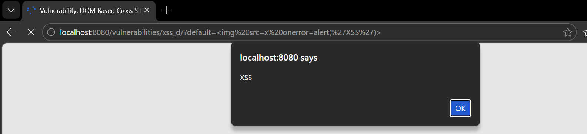

**Explanation of why it worked:**
At Low security, any payload including script tags worked. At Medium security, the application likely filters out `<script>` tags specifically, but fails to block other HTML tags that can execute JavaScript, such as `` with `onerror` events. The image tag attempts to load an invalid image source (`x`), which triggers the `onerror` event and executes the JavaScript code.

**Explanation of why it failed at higher level:**
At higher security levels, the application implements more comprehensive input sanitization that encodes or removes all dangerous HTML tags and JavaScript events, not just script tags. This prevents any form of injected JavaScript from executing regardless of the vector used.


-----


