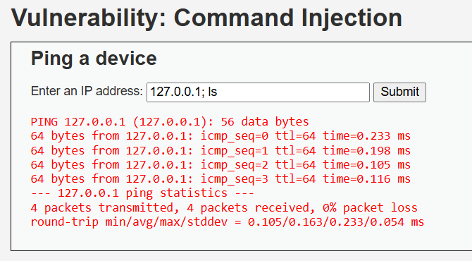
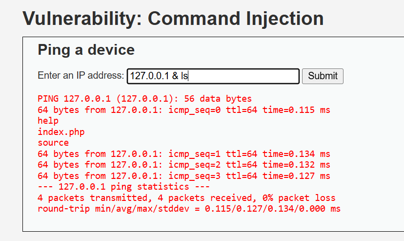
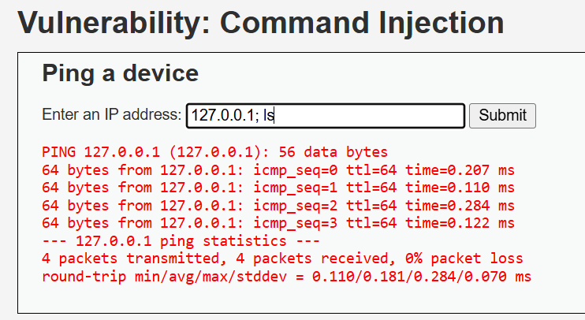
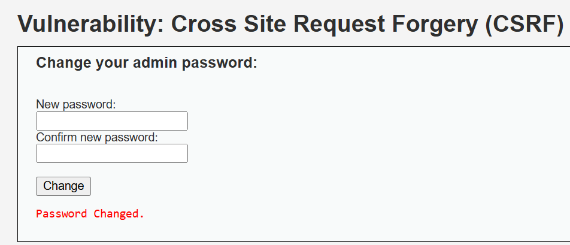
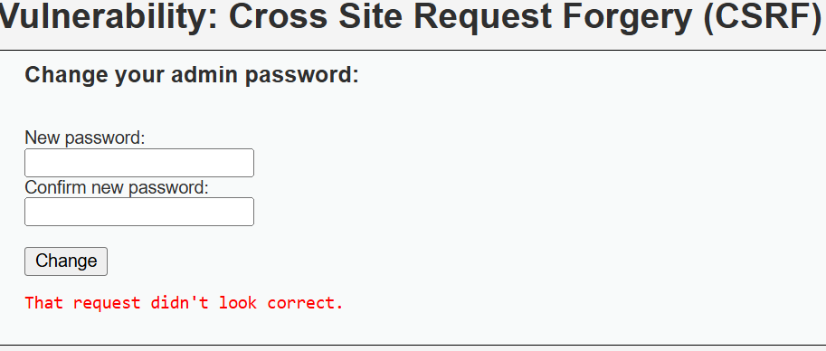
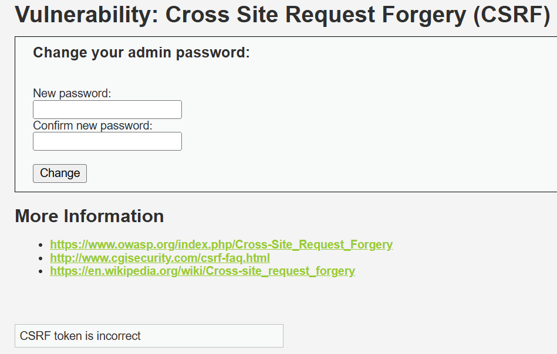
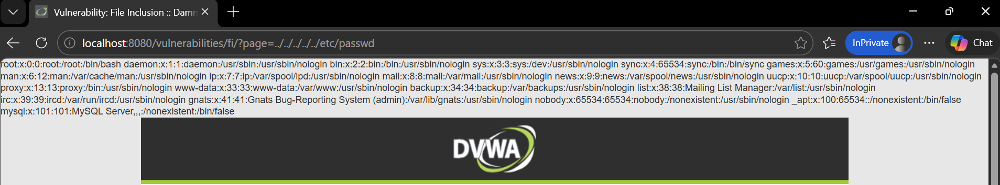
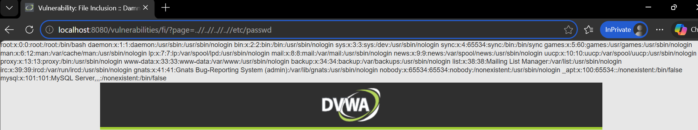

## DVWA Security Report

## Command Injection

### Security Level: Low

**Payload Used:** `127.0.0.1; ls`

**Result:** Success - Both the ping command and the directory listing command executed, displaying the contents of the current directory after the ping results.

**Screenshot:**


**Explanation of why it worked:**
The application passes user input directly to the system shell without any validation or sanitization. The semicolon (;) acts as a command separator, allowing multiple commands to be chained together. Since the input is not checked to ensure it contains only an IP address, the system executes both the intended ping command and the injected ls command.

**Explanation of why it failed at higher level:**
At Medium security, the application begins filtering certain characters like semicolons, but the filtering is incomplete and can be bypassed. At High security, proper input validation is implemented to only allow IP address formats.

### Security Level: Medium

**Payload Used:** `127.0.0.1 & ls`

**Result:** Success - The ampersand (&) operator allowed command injection, executing both the ping and ls commands.

**Screenshot:**


**Explanation of why it worked:**
At Medium security, the application filters out semicolons (;) but fails to block other command separators like the ampersand (&). The application uses a blacklist approach that is incomplete, blocking only certain characters while leaving others vulnerable. The ampersand tells the shell to run the first command and then execute the second command in the background, allowing the injection to succeed.

**Explanation of why it failed at higher level:**
At High security, the application implements proper input validation using a whitelist approach. It strictly validates that the input contains only characters that belong to an IP address (numbers and dots) and rejects any input with special characters, shell metacharacters, or non-IP address patterns. This prevents any command injection regardless of which operator is used.

### Security Level: High

**Payload Used:** `127.0.0.1; ls`

**Result:** Failed - Only the ping command executed. The directory listing (ls) did not appear in the output.

**Screenshot:**


**Explanation of why it failed at higher level:**
At High security, the application implements proper input validation using a whitelist approach. It strictly validates that the input contains only characters that belong to a valid IP address format (numbers and dots). Any input containing special characters, letters, or shell metacharacters like semicolons (;) is rejected or sanitized before being passed to the system. This prevents command injection by ensuring only the intended IP address is processed by the ping command.


## Cross Site Request Forgery (CSRF)

### Security Level: Low

**Payload Used:**
```html
<html>
  <body>
    <h1>Win a Free Gift Card!</h1>
    <p>Click the button below to claim your $100 Amazon gift card:</p>
    
    <form action="http://localhost:8080/vulnerabilities/csrf/" method="GET">
      <input type="hidden" name="password_new" value="attacker123" />
      <input type="hidden" name="password_conf" value="attacker123" />
      <input type="hidden" name="Change" value="Change" />
      <input type="submit" value="Claim Your Gift Card!" />
    </form>
  </body>
</html>
```

**Result:** Success - The password was changed from "newpassword123" to "attacker123" without requiring the current password or any additional verification. The attack worked by simply getting the authenticated user to click a button on a malicious page.

**Screenshot:**


**Explanation of why it worked:**
The application accepts password changes via GET requests with all parameters in the URL. It does not implement any anti-CSRF tokens, does not require the current password for verification, and relies solely on session cookies for authentication. When an authenticated user visits a malicious page, their browser automatically includes their session cookies with the forged request. The server sees a valid session and processes the password change request, unable to distinguish between a legitimate request from the actual user and a forged request from an attacker's site.

**Explanation of why it failed at higher level:**
At higher security levels, the application implements anti-CSRF tokens that must accompany state-changing requests. These tokens are unique per session and validated by the server, making it impossible for an attacker to forge a valid request without knowing the current token. Additionally, the application may require current password verification or switch to using POST requests for sensitive operations, further protecting against CSRF attacks.


### Security Level: Medium
**Payload Used:**
```html
<html>
  <body>
    <form action="http://localhost:8080/vulnerabilities/csrf/" method="GET">
      <input type="hidden" name="password_new" value="mediumtest123" />
      <input type="hidden" name="password_conf" value="mediumtest123" />
      <input type="hidden" name="Change" value="Change" />
      <input type="submit" value="Click me!" />
    </form>
  </body>
</html>
```

**Result:** Failed - The request was rejected with the message "That request didn't look correct."

**Screenshot:**


**Explanation of why it worked:**
At Low security, the application accepts password changes via GET requests without any validation of where the request originated. It does not implement anti-CSRF tokens or require the current password, allowing any malicious site to forge requests as long as the user is authenticated. The server blindly trusts the request because the user's session cookie is automatically included by the browser.

**Explanation of why it failed at higher level:**
At Medium security, the application validates the HTTP Referer header to ensure the request originated from the same domain. When the malicious HTML file is opened locally, it sends no Referer header or one that doesn't match localhost, causing the server to reject the request as suspicious.


### Security Level: High

**Payload Used:**
```html
<html>
  <body>
    <form action="http://localhost:8080/vulnerabilities/csrf/" method="GET">
      <input type="hidden" name="password_new" value="hightest123" />
      <input type="hidden" name="password_conf" value="hightest123" />
      <input type="hidden" name="Change" value="Change" />
      <input type="submit" value="Click me!" />
    </form>
  </body>
</html>
```

**Result:** Failed - The request was rejected with the message "CSRF token is incorrect."

**Screenshot:**


**Explanation of why it worked:**
At Low security, the application accepts password changes via GET requests without any validation of where the request originated. It does not implement anti-CSRF tokens or require the current password, allowing any malicious site to forge requests as long as the user is authenticated. The server blindly trusts the request because the user's session cookie is automatically included by the browser.

**Explanation of why it failed at higher level:**
At High security, the application implements anti-CSRF tokens that are unique to each user session. These tokens are generated by the server, embedded in forms, and must be submitted with any state-changing request. When a malicious site attempts to forge a request, it cannot know or include the correct token because it changes per session and cannot be predicted or obtained by an attacker from a different domain. The server validates the token before processing the password change, rejecting any request with a missing or incorrect token.


## File Inclusion

### Security Level: Low

**Payload Used:**`http://localhost:8080/vulnerabilities/fi/?page=../../../../../etc/passwd`

**Result:** Success - The contents of the /etc/passwd file were displayed, revealing system user accounts.

**Screenshot:**


**Explanation of why it worked:**
The application takes the 'page' parameter and directly includes it in a PHP include statement without any validation or sanitization. By using `../../../../../` directory traversal sequences, we can navigate up the directory structure to reach the root directory and then access sensitive system files like `/etc/passwd`. The server does not check if the requested file is within an allowed directory or if the path contains suspicious patterns.

**Explanation of why it failed at higher level:**
At higher security levels, the application implements input validation to block directory traversal sequences like `../` and restricts file inclusion to specific allowed files only. It may also use whitelisting to ensure only files from a predefined directory can be included.


### Security Level: Medium

**Payload Used:**`http://localhost:8080/vulnerabilities/fi/?page=..//..//..//..//etc/passwd`

**Result:** Success - The contents of the /etc/passwd file were displayed by bypassing the input filter using double slashes.

**Screenshot:**


**Explanation of why it worked:**
At Low security, no validation was performed, allowing direct directory traversal. The application blindly included any file path provided.

**Explanation of why it failed at higher level:**
At Medium security, the application implements basic filtering that removes or blocks `../` patterns. However, this filter is incomplete and can be bypassed using `..//` which still achieves directory traversal. The filter fails to recursively sanitize the input or account for variations in path traversal syntax. At High security, more robust validation would be implemented to block all such bypass attempts.


